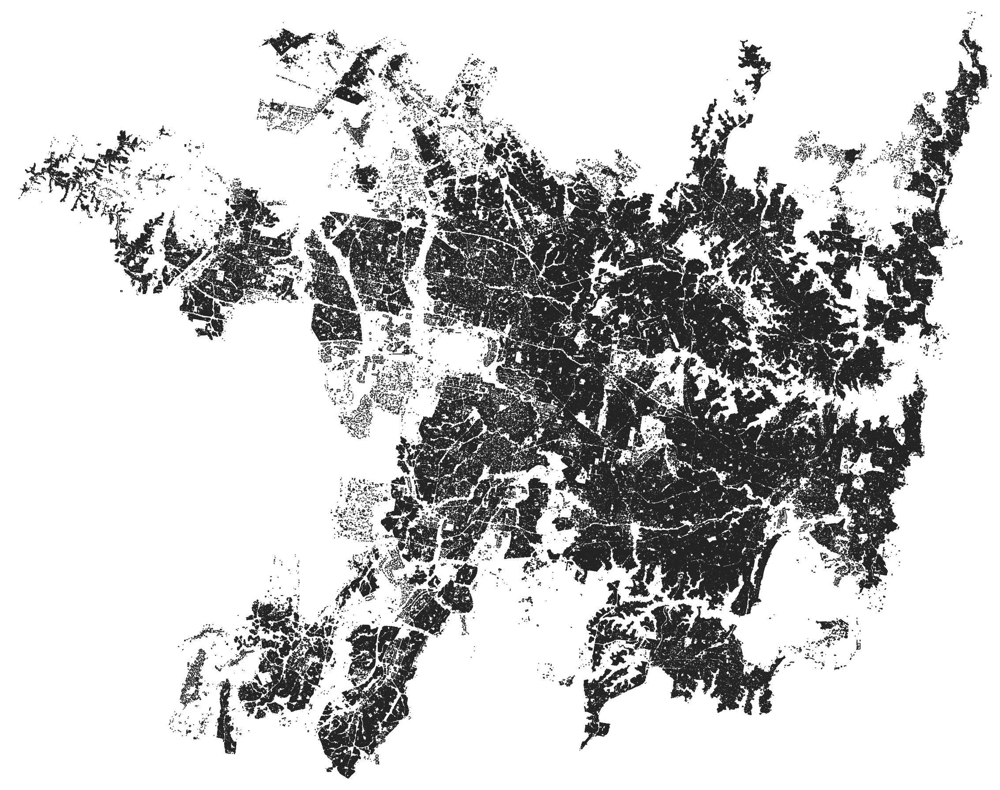

<p align="center">
    <h1 align="center"> <br> AIGIS</h1>
	


</p>
<p align="center">
    <em>AI annotation, segmentation, and conversion tools for GIS imagery</em>
</p>
<p align="center">
	
	
	
	
<p>
<p align="center">
	</p>
<hr>


# aigis

`aigis` is a comprehensive toolkit for aerial and satellite imagery acquisition, processing, annotation, and analysis using artificial intelligence. This repository contains three main components:

1. **annotate:** Tools for annotating aerial imagery data.
2. **convert:** Utilities for converting aerial imagery data to various formats, including COCO, GeoJSON, etc.
3. **segment:** Scripts and notebooks for segmenting aerial imagery using deep learning models.

## Why `aigis`?

Rather than develop models that depend on getting a time series of images, specific input resolutions, electromagentic radiation bands, or mission prameters, we've created an AI GIS toolkit that uses generalist visual light vision transformer and MaskRCNN models.

Train, test, deploy bespoke prediction models to classify, detect, and segment aerial & satellite imagery with `aigis`.

But wait, you don't have training data? No problem, use `aigis.annotate` module and generate annotations from scratch!

Take those annotations and run them through `aigis.segment` pipeline and now you have lightweight, production ready models that can run at continental scale or be deployed on compute-limited edge applications for real-time inference in the field.

The glue linking this all together, `aigis.convert`, supports seemless transformation of geospatial data into the forms AI models need, and then bringing model predictions back into GIS analysis ready forms.

## Installation

Create a python environment for the project, we recommend [`conda`](https://www.anaconda.com/download):

```bash
conda create -n aigis python==3.10
conda activate aigis
```

Clone the repository:

```bash
git clone https://github.com/Sydney-Informatics-Hub/aigis.git

pip install -e aigis
```

## Usage

### Recommended System Requirements

All tools were built for Linux or MacOS systems.

High resolution aerial imagery quickly becomes very computationally intensive to work with, so we recommend using high powered workstations or cloud computing environments.

Model fine tuning are best with CUDA GPUs. One or more RTX 4090 or A100 GPUs are recommended for best performance. 
Models can be fine tuned on Google Colab free T4 GPUs, but larger datasets and longer runs should run on other compute platforms.

Inference and postprocessing both benefit from CUDA GPUs.

## `aigis` datasets

Explore our two featured example datasets using a [Felt map](https://felt.com/map/Sydney-Buildings-6drWs3o9ARViitVdt6qp60A?loc=-33.8282,150.8961,10.93z).


To load the matching NSW SixMaps aerial photography you have to click 1. background layers, then select 2. NSW SixMaps, as in the image above.

### Building Segmentation

We've used the full `aigis` toolkit to fine tune segmentation models to detect and segment building outlines in aerial imagery. Our fine tuned model was then run on 37,000 high reslution aerial images across the entire Greater Sydney Urban area in New South Wales, Australia. 

Our models's predictions are available as a shapefile in GeoParquet, with almost one million buildings.



### Tree Segmentation

We've used the full `aigis` toolkit to fine tune segmentation models to detect and segment tree patch outlines in aerial imagery. Our fine tuned model was then run on 37,000 high reslution aerial images across the entire Greater Sydney Urban area in New South Wales, Australia. 

Our models's predictions are available as a shapefile in GeoParquet, with 2 million tree patches.


##  Contributing

Contributions are welcome! Here are several ways you can contribute:

- **[Submit Pull Requests](https://github/Sydney-Informatics-Hub/aigis/blob/main/CONTRIBUTING.md)**: Review open PRs, and submit your own PRs.
- **[Join the Discussions](https://github/Sydney-Informatics-Hub/aigis/discussions)**: Share your insights, provide feedback, or ask questions.
- **[Report Issues](https://github/Sydney-Informatics-Hub/aigis/issues)**: Submit bugs found or log feature requests for Aigis.

<details closed>
    <summary>Contributing Guidelines</summary>

1. **Fork the Repository**: Start by forking the project repository to your GitHub account.
2. **Clone Locally**: Clone the forked repository to your local machine using a Git client.
   ```sh
   git clone https://github.com/Sydney-Informatics-Hub/aigis
   ```
3. **Create a New Branch**: Always work on a new branch, giving it a descriptive name.
   ```sh
   git checkout -b new-feature-x
   ```
4. **Make Your Changes**: Develop and test your changes locally.
5. **Commit Your Changes**: Commit with a clear message describing your updates.
   ```sh
   git commit -m 'Implemented new feature x.'
   ```
6. **Push to GitHub**: Push the changes to your forked repository.
   ```sh
   git push origin new-feature-x
   ```
7. **Submit a Pull Request**: Create a PR against the original project repository. Clearly describe the changes and their motivations.

Once your PR is reviewed and approved, it will be merged into the main branch.

</details>

---

## About Us

This software was developed by the Sydney Informatics Hub, a core research facility of the University of Sydney.

The project team includes:

- Henry Lydecker
- Sahand Vahidnia
- Xinwei Luo
- Thomas Mauch

##  License

This project is protected under the [MIT Licence](https://choosealicense.com/licenses) License. For more details, refer to the [LICENSE](https://choosealicense.com/licenses/) file.


##  Acknowledgments

Acknowledgements are an important way for us to demonstrate the value we bring to your research. Your research outcomes are vital for ongoing funding of the Sydney Informatics Hub. If you make use of this software for your research project, please include the following acknowledgement:

>This research was supported by the Sydney Informatics Hub, a Core Research Facility of the University of Sydney.
